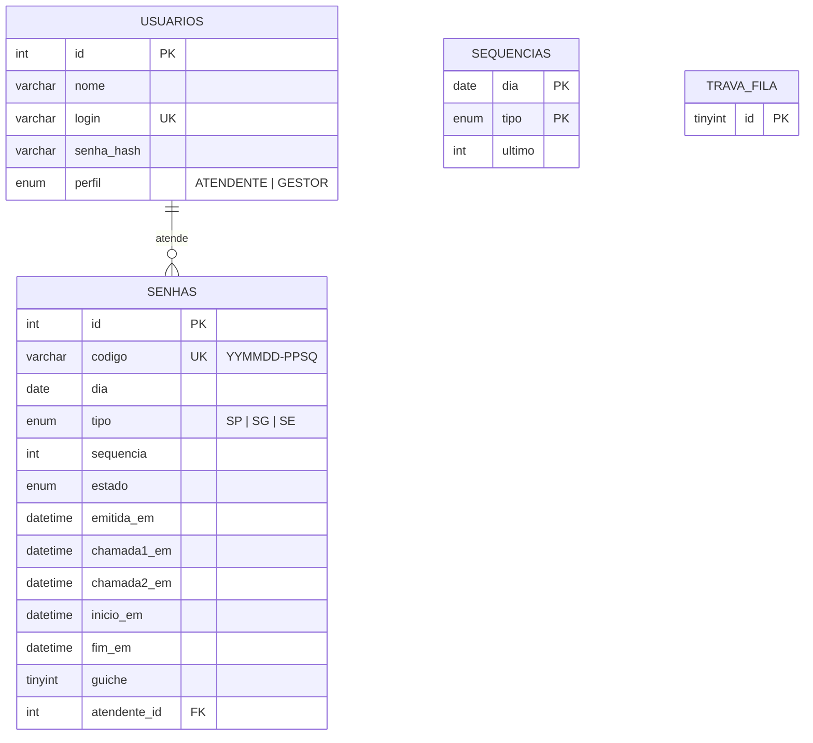

# MER — nassauTickets

Script físico: [`backend/db/schema.sql`](../../backend/db/schema.sql)

- `SENHAS.atendente_id` é nulo até a senha ser chamada.
- `SEQUENCIAS` gera o `SQ` por dia e tipo (reinício diário).
- `TRAVA_FILA` tem uma única linha, bloqueada (`FOR UPDATE`) a cada "chamar próxima" para serializar chamadas concorrentes (RNF05).
- O cliente é anônimo: não existe tabela de clientes (LGPD, RNF10).
