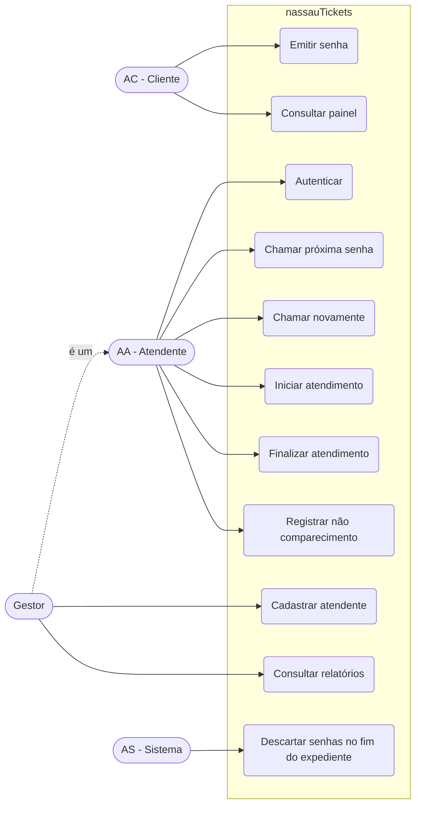
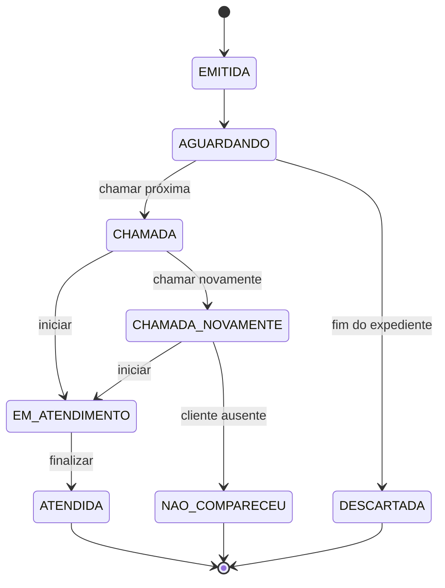
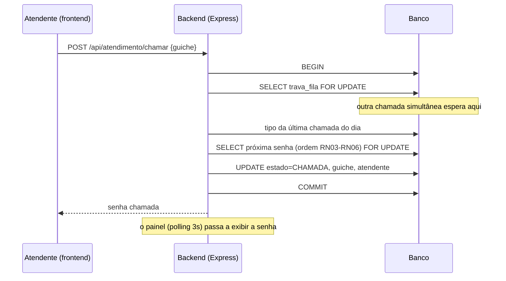
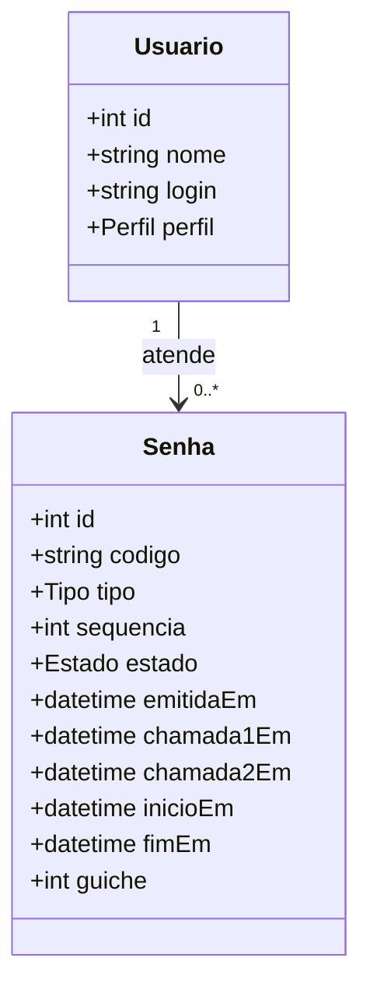

# Diagramas UML — nassauTickets

## Casos de uso

```mermaid
flowchart LR
    AC([AC - Cliente])
    AA([AA - Atendente])
    GE([Gestor])
    AS([AS - Sistema])
    GE -. "é um" .-> AA

    subgraph nassauTickets
        UC1(Emitir senha)
        UC2(Consultar painel)
        UC3(Autenticar)
        UC4(Chamar próxima senha)
        UC5(Chamar novamente)
        UC6(Iniciar atendimento)
        UC7(Finalizar atendimento)
        UC8(Registrar não comparecimento)
        UC9(Cadastrar atendente)
        UC10(Consultar relatórios)
        UC11(Descartar senhas no fim do expediente)
    end

    AC --> UC1
    AC --> UC2
    AA --> UC3
    AA --> UC4
    AA --> UC5
    AA --> UC6
    AA --> UC7
    AA --> UC8
    GE --> UC9
    GE --> UC10
    AS --> UC11
```

## Máquina de estados da senha

```mermaid
stateDiagram-v2
    [*] --> EMITIDA
    EMITIDA --> AGUARDANDO
    AGUARDANDO --> CHAMADA : chamar próxima
    AGUARDANDO --> DESCARTADA : fim do expediente
    CHAMADA --> CHAMADA_NOVAMENTE : chamar novamente
    CHAMADA --> EM_ATENDIMENTO : iniciar
    CHAMADA_NOVAMENTE --> EM_ATENDIMENTO : iniciar
    CHAMADA_NOVAMENTE --> NAO_COMPARECEU : cliente ausente
    EM_ATENDIMENTO --> ATENDIDA : finalizar
    ATENDIDA --> [*]
    NAO_COMPARECEU --> [*]
    DESCARTADA --> [*]
```

## Sequência — chamar próxima senha (concorrência)

```mermaid
sequenceDiagram
    participant AA as Atendente (frontend)
    participant API as Backend (Express)
    participant DB as Banco
    AA->>API: POST /api/atendimento/chamar {guiche}
    API->>DB: BEGIN
    API->>DB: SELECT trava_fila FOR UPDATE
    Note over DB: outra chamada simultânea espera aqui
    API->>DB: tipo da última chamada do dia
    API->>DB: SELECT próxima senha (ordem RN03-RN06) FOR UPDATE
    API->>DB: UPDATE estado=CHAMADA, guiche, atendente
    API->>DB: COMMIT
    API-->>AA: senha chamada
    Note over API: o painel (polling 3s) passa a exibir a senha
```

## Classes (domínio)

```mermaid
classDiagram
    class Usuario {
        +int id
        +string nome
        +string login
        +Perfil perfil
    }
    class Senha {
        +int id
        +string codigo
        +Tipo tipo
        +int sequencia
        +Estado estado
        +datetime emitidaEm
        +datetime chamada1Em
        +datetime chamada2Em
        +datetime inicioEm
        +datetime fimEm
        +int guiche
    }
    Usuario "1" --> "0..*" Senha : atende
```
